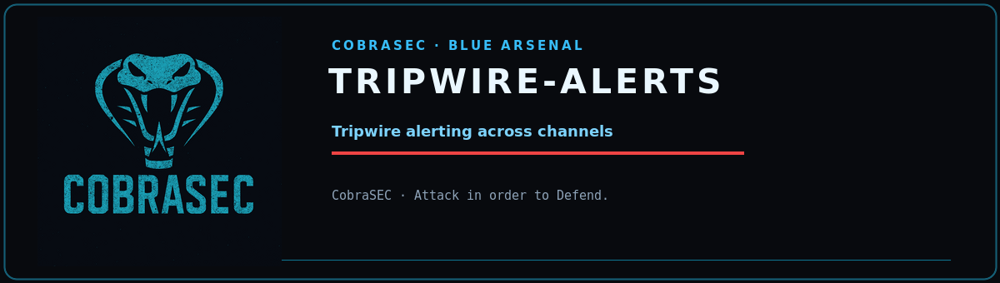

<p align="center">
  
</p>

<p align="center">
  
  
  
  
</p>

<h1 align="center">tripwire-alerts</h1>
<p align="center"><b>Filesystem tripwire alerting</b><br><sub><i>CobraSEC · Attack in order to Defend.</i></sub></p>

---


Channels:
  - Slack webhook
  - Discord webhook
  - Telegram bot (sendMessage)
  - Generic webhook (POST JSON)
  - Email (SMTP)
  - Syslog
  - Local log file

Design:
  - Reads alert events as JSON lines from stdin (pipeline-friendly)
  - Or send single messages via CLI
  - Config file: /etc/tripwire/config.json or ~/.config/tripwire/config.json
  - Per-severity channel routing (critical → all channels, info → log only)
  - Message batching, retry with backoff, throttling
  - All findings from arsenal tools can be piped here

Config format (/etc/tripwire/config.json):
{
  "slack":   {"webhook_url": "https://hooks.slack.com/services/..."},
  "discord": {"webhook_url": "https://discord.com/api/webhooks/..."},
  "telegram": {"bot_token": "...", "chat_id": "..."},
  "webhook": {"url": "http://siem:8080/ingest", "headers": {"X-Key": "..."}},
  "smtp":    {"host": "smtp.example.com", "port": 587, "user": "...",
              "password": "...", "from": "sentry@example.com",
              "to": ["soc@example.com"]},
  "syslog":  {"enabled": true, "facility": "local0"},
  "file":    {"path": "/var/log/tripwire_alerts.log"},
  "min_severity": "medium",
  "batch_seconds": 2
}

Usage:
  echo '{"severity":"critical","rule":"SSH Brute Force","ip":"1.2.3.4"}' | python3 tripwire_alerts.py
  python3 tripwire_alerts.py send --channel slack --severity critical --message "Honeypot hit from 1.2.3.4"
  python3 tripwire_alerts.py --test          # send test message to all channels
  python3 tripwire_alerts.py --check-config  # validate config
  roothunter.py | python3 tripwire_alerts.py --parse-lines

## Requirements

- Python 3.8+ (standard library only — no external dependencies)

## Usage

```
python3 tripwire_alerts.py --help
```

```
usage: tripwire_alerts.py [-h] [--config CONFIG] [--channel CHANNEL]
                          [--severity {critical,high,medium,low,info}]
                          [--message MESSAGE] [--rule RULE] [--ip IP]
                          [--user USER] [--detail DETAIL] [--parse-lines]
                          [--test] [--check-config] [--init-config]
                          [send]

Tripwire Alerts — Central Alerting Hub

positional arguments:
  send                  send subcommand

options:
  -h, --help            show this help message and exit
  --config, -c CONFIG   Config file path
  --channel CHANNEL     Channel for send
                        (slack/discord/telegram/webhook/email/syslog/file)
  --severity {critical,high,medium,low,info}
  --message, -m MESSAGE
                        Message to send
  --rule RULE           Rule/title for the event
  --ip IP               Source IP
  --user USER           Username
  --detail DETAIL       Detail line
  --parse-lines         Parse raw scanner output lines from stdin instead of
                        JSON
  --test                Send test message to all channels
  --check-config        Validate configuration
  --init-config         Write config template
```

## Notes

- Defensive tooling: run only on systems you own or are authorized to assess.
- Read-only by design where possible; review flags before use on production hosts.
- Some checks (disk sectors, process memory, raw sockets) require root.
